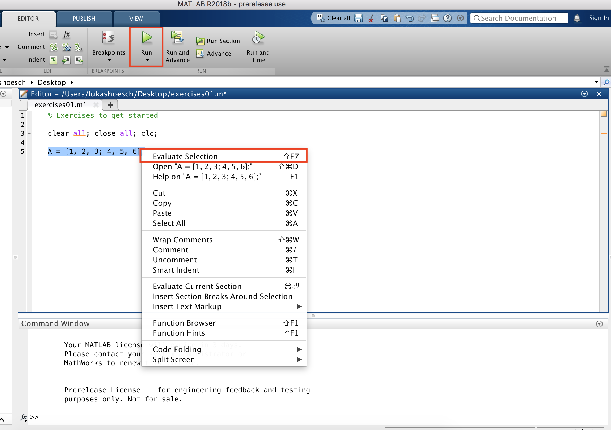
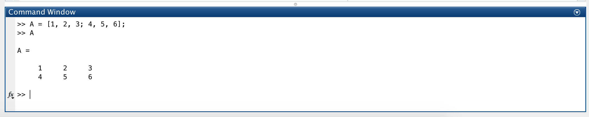

# Graphical User Interface

## Executing commands

In MATLAB you can execute commands either by directly entering them into the command window or by executing them from the script editor.

The most common way to execute commands is while working on a script/program \(called _.m file_\). After opening a \(new\) script in MATLAB, enter the commands into the script editor, then execute single commands by right-clicking on them and choosing "Evaluate" or run your whole script by clicking "Run". A good tip is to always start your script with the following three commands that will clear your workspace, close any open plots and clear the console.

```text
clear all; close all; clc;
```



Alternatively, you can execute commands by directly typing them into the command window and hitting the return key \(Enter\) on your keyboard to evaluate them. This is very useful e.g. for trying out commands, opening help/documentation on a command or performing one-time actions such as manually exporting data.




