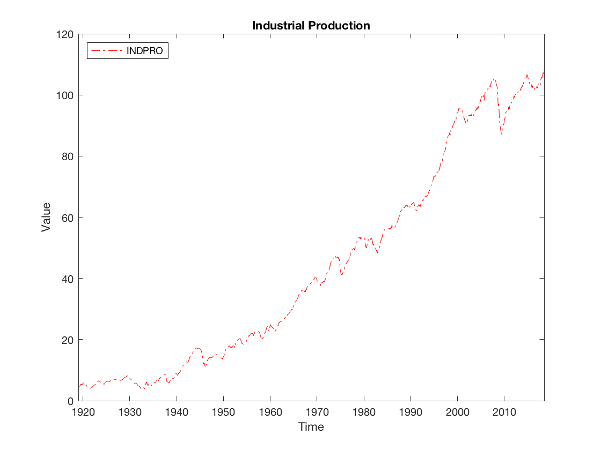
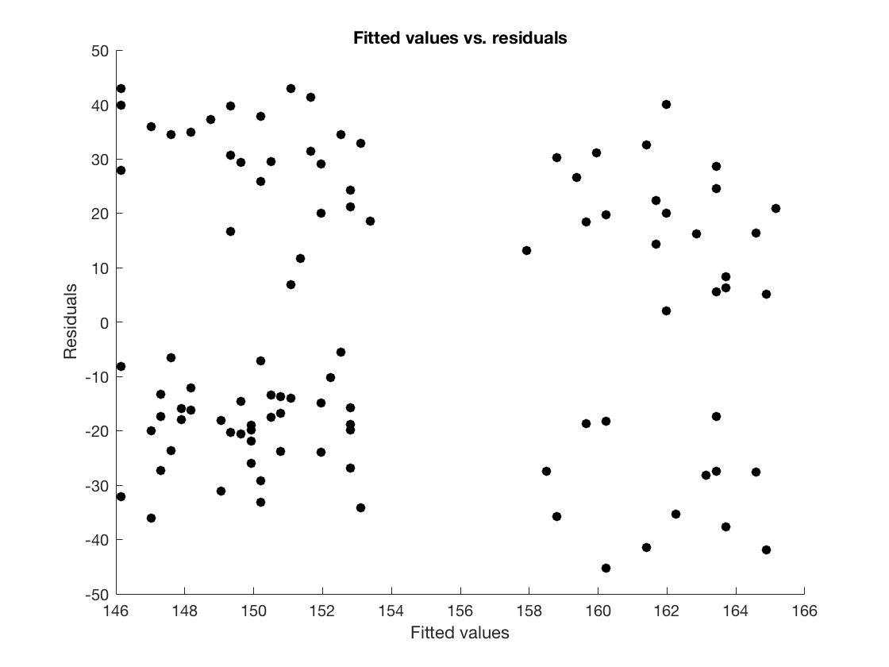

# Creating Graphs

## Creating publication-ready graphs

In this section we will learn how to use MATLABs powerful graphics engine to create graphs that are ready for publication.


To run the plot commands in this sections, download the following dataset package which contains a few series from the FRED database \(publicly available at [http://fred.stlouisfed.org](http://fred.stlouisfed.org)\).




### Line plots with the `plot` command

We will start by learning how to create line plots which are used to e.g. plot time-series data in Econometric or Macroeconomic applications.

The `plot` command has three typical use cases.

* `plot(y)` plots variable `y` against its index
* `plot(x, y)` plots `y` against the values in `x`. This requires that `x` and `y` have the same length.
* `plot(x, y, format)` is the same as above, but graphical parameters that determine the color, markers and line style of the plot are passed via `format`.

Consider the following example where we plot the industrial production series from the last section.

```text
load freddata;
plot(dates, indpro, 'r-.');
xlabel('Time');
ylabel('Value');
title('Industrial Production');
legend('INDPRO','Location','NorthWest');
```

Here `'r-.'` is the format string that tells MATLAB to use red color \(`r`\) and to choose a dashdot line style \(`-.`\). To see all options for the formatting strings type `help plot` into the console window.

The command produces the following graph.



### Plot Annotation

Plot Annotations can be used to set title, axis labels, the legend etc. In the example above you already saw some annotation commands. Here is a non-exhaustive list of useful annotation commands.

* `title(labelstring)` - sets the main title of the plot to the value of `labelstring`.
* `xlabel(string)` - sets the label of the x-axis to the value of `labelstring`
* `ylabel(string)`- sets the label of the y-axis to the value of `labelstring`
* `grid` - `grid on` and `grid off` activate and deactivate major grid lines in the plot, respectively. `grid minor` toggles additional finer grid lines.

### Plot configuration

Plot configuration commands can be used to set the scaling of axes, deactivate axis labels or to control other behaviour of the plot area. Here is a non-exhaustive list of useful configuration commands.

* `xlim([start end])` - sets the scale of the x-axis such that it starts at the number `start` and ends at the number  `end`
* `ylim([start end])` - sets the scale of the y-axis such that it starts at the number `start` and ends at the number `end`

### Controlling multiple plots with `figure`

Often we would like to create multiple plots in one script. While it is possible to execute multiple `plot` commands after each other and create multiple plot windows, we only have access to the plot that was created last i.e. if we e.g. would like to use annotation or configuration commands to change the first plot we created after adding another plot this will not be possible.

The `figure` command allows us to get a handle on plots so that we can access them even after running multiple plot commands.

There are two uses of the command: `handlevar = figure;` creates a new figure and saves a handle to it in the variable `handlevar`. `figure(handlevar)` activates the figure with handle saved in `handlevar` for further editing/annotation.

Here is an example.

```text
load freddata;

myfirstfigure = figure;
plot(dates, indpro);

mysecondfigure = figure;
plot(dates, unrate);

title('Not my first figure!');    % Will add the title to the second figure

figure(myfirstfigure);            % Activate the first figure again
title('My first figure!');        % Now the title is added to the first figure
```

It is a good practice to start every plot with a figure command, even if you do not wish to make changes to the plot later. That is a typical use of the plot command would look like this.

```text
figure;
plot(dates, indpro);
```

#### Closing plots with `close`

Sometimes we would like to close the plotting window that is currently open or close a specific plot. We can do this using the `close` command. There are three different use-cases.

* `close` - closes the current figure window.
* `close(handlevar)` closes the figure whose handle was saved in `handlevar`
* `close all` - closes all plots

## Grouping plots with `subplot`

Often we would like to group multiple plots into one panel to be able to compare them side by side. We can achieve this by calling the `subplot` command after the `figure` command to arrange the plots into a matrix of plots. The subplot command has the following syntax.

> `subplot(m, n, p)` tells MATLAB that we would like to group `m` rows and `n` columns of plots. `p` is the index of the current subplot that we would like to edit where `p` is betwen 1 and `m*n` \(i.e. the total number of elements in the plotmatrix\). Note that for subsequent calls to `subplot` within a figure, `m` and `n` have to match across all `subplot` commands whereas `p` is changing depending on which plot we are editing.

Here is an example.

```text
load freddata;

mygroupplot = figure;

subplot(1, 2, 1); % 1 row, 2 columns, this is number 1
plot(dates, indpro);
title('First plot');

subplot(1, 2, 2);
plot(dates, unrate);
title('My second plot');
```

Note that when you create plot matrices with multiple rows and columns, `p` is counted row-wise i.e. the first `n` values of `p` activate the plots along the first row, the next `n` values of `p` activate the plots along the second row etc.

## Other important plot types

Sometimes we would like to use other plot-types like scatter plots or bar plots. MATLAB also offers commands to create these plots. Here are a few plot types that are used in academic papers in economics. All the notation and configuration commands, as well as the `figure` and `subplot` commands carry over to these plot types.

### Scatterplots using the `scatter` command

The `scatter` command plots two variables against each other by displaying coloured circles at the locations specified by the two variables. Scatterplots thus allow to see whether there is any relationship between the two variables. The syntax of the command is the following.

> `scatter(x, y, s, c)` plots a scatterplot of vectors `x` and `y` where both vectors need to have the same length. `s` determines the size of the markers. It can either be a scalar in which case all markers have the same size or it can be a vector of the same length than `x` and `y` specifying individual sizes for each marker. `c` determines the colour of each marker. When `c` is a scalar all markers have the same colour, if `c` is a vector of the same length than `x` and `y` then the values of c are used to linearly interpolate the colours, taking as a basis the current colormap defined in MATLAB.

Consider the following example which creates a scatterplot of residuals from an OLS regression. In this example, the weight of 100 hospital patients was regressed on their age as well as a binary indicator for whether they smoke or not.

> **Note:** To run the examples in this section, download the following dataset which contains data on the fitted values and residuals from the regression described above.



```text
load olsfitdata;

scatter(fitted_values, residuals, 'filled', 'black');
xlabel('Fitted values');
ylabel('Residuals');
title('Fitted values vs. residuals')
```

This procudes the following plot.



## Exporting plots for publications

Often we would like to save our figures to the hard-drive to include them in Word or LaTeX documents that we are writing. To distribute plots for publications it is best practice to use the _.pdf or .eps_ file format.

### Exporting figures using the print command

We can use MATLABs `print` command to export plots in a variety of different formats. `print(filename, formattype)` exports the current plot to the file `filename` using the format specified in the format string `formattype`.

The following format types are often used.

| **Format string** | **Format** | **Comment** |
| :--- | :--- | :--- |
| '-dpdf' | .pdf | Vector graphic, scales well, suitable for publications. Can be opened by most programs. |
| '-depsc' | .eps | Vector graphic, scales well, suitable for publications, but can´t be read by most programs. Optimized for professional printing. |
| '-dtiff' | .tiff | Bitmap image, does not scale well. Can be opened by most programs. Not suitable for publications. |
| '-djpg' | .jpg | Bitmap image, does not scale well. Most commonly used format for images. Not suitable for publications. |
| '-dpng' | .png | Bitmap image, does not scale well. Very small file size, suitable for webpages, blogs etc. |

Here is an example.

```text
load freddata;

indpro_plot = figure;
plot(dates, indpro);
title('INDPRO series');

print('indpro_series', '-dpdf');
```

### Fixing issues with whitespace around the plot

By default the `print` command will add a lot of whitespace to your plot to fill the paper layout. This is undesirable when one wants to save plots to include them in articles, books etc.

We can avoid this behaviour by reading the dimensions of the figure using the figure handle and then setting the paper size appropriately.

You can download a function here that helps you to achieve this. Unzip the folder and copy the file `save_as_pdf.m` into your current working directory.



Here is an example of how to use the `save_as_pdf` function.

```text
load freddata;
indpro_plot = figure; plot(dates, indpro); title('INDPRO series'); xlabel('Year');
save_as_pdf(indpro_plot, 'indpro_series');
```

