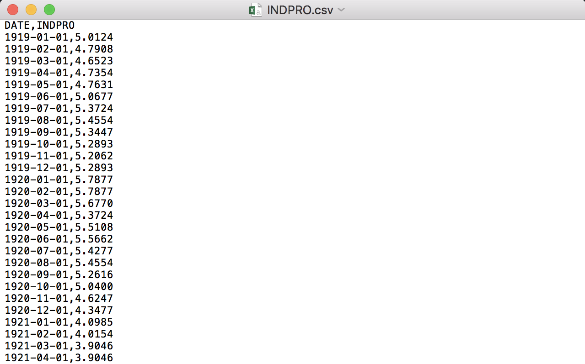
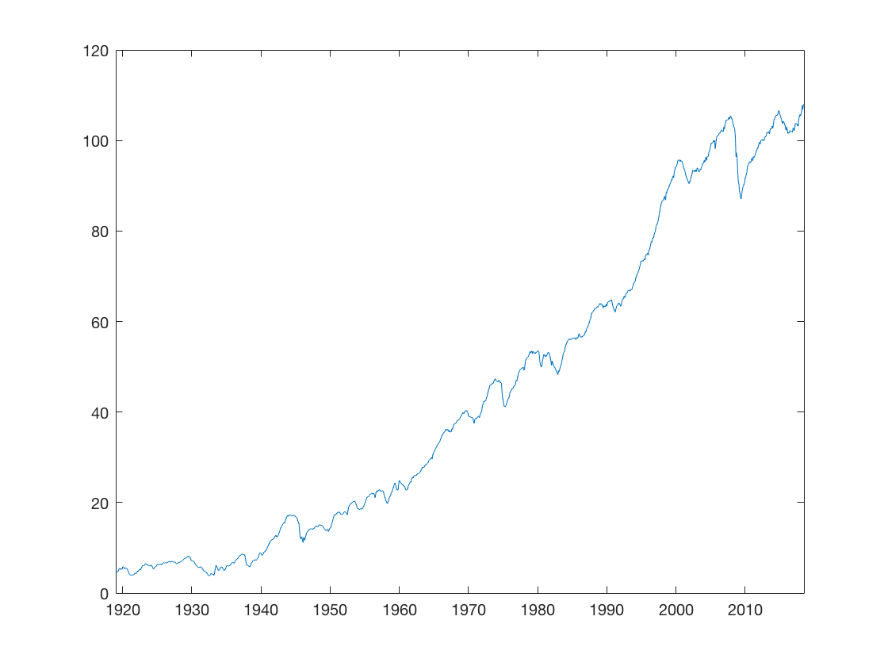

# Working with Datasets

## Importing data

Often, we would like to process data in MATLAB that comes from an external source and which is supplied in either .csv or .xls/.xlsx format. MATLABs `importdata`, `csvread` and `xlsread` commands allow us to easily read and process data files.

### Reading .csv files with `importdata` or `csvread`

_For the example below, please download the INDPRO series from_ [_https://fred.stlouisfed.org/series/INDPRO_](https://fred.stlouisfed.org/series/INDPRO) _as a .csv file_

The `importdata` command has the following syntax.

> `importdata(file, delimiter, skiprows)` loads data from `file` where the data columns are separated with the `delimiter` char and numeric data starts at line `skiprows+1`.

A quick look at the _INDPRO.csv_ file reveals that the numeric data starts in line 2 and columns are separated by commas \(,\).



Therefore, we can use the following command to read the industrial production series.

```text
mydata = importdata('./INDPRO.csv', ',', 1);
```

The command creates a struct object called `mydata` which contains two sub-objects, a matrix called `data` containing all numerical data from the file \(in this case the values of the series\) and a cell-array called `textdata` which contains the string from the file \(here header names and dates\). We can explore these objects in the workspace browser or by accessing them directly.

```text
mydata.data(1:10) % get first 10 rows of INDPRO series
mydata.textdata(1,:) % look at header names of the data
```

Alternatively we can also read in only the numeric data, by using the `csvread` command. `csvread` has the following syntax.

> `csvread(file, rowindex, columnindex)` reads numeric data from `file` starting in row `rowindex` and column `colindex` where 0 is the first row/column.

If we only want to read the values of the INDPRO series \(which starts in the second row and second column\), we can use the following command.

```text
indpro = csvread('./INDPRO.csv', 1, 1)
```

### Reading .xls/.xlsx files with `xlsread`


Reading excel files works best on Windows. If you are using macOS it is best practice to use .csv files if they are available or to open the .xls file in excel and to export it in a .csv format. Files in a .xlsx format usually tend to work.


_For the example below, please download the UNRATE series from_ [https://fred.stlouisfed.org/series/UNRATE](https://fred.stlouisfed.org/series/UNRATE) _as an .xls file and save it as an .xlsx file using excel._

`xlsread` has the following syntax.

> `xlsread(file, sheetname, excelrange)` reads data from `file` and worksheet `sheet` where the data is in the block `excelrange` \(which is supplied in the typical excel format e.g. B2:F18\).

In order to read the UNRATE series, we can use the following command.

```text
unrate = xlsread('./UNRATE.xls', 'FRED Graph', 'B12:B858')
```

## Converting string dates with `datetime`

Often when importing time series data, dates or datetimes are supplied as strings in various formats. When using the `importdata` command, dates are thus treated as _textdata_ and imported as vectors of strings. In order to work with dates to e.g. plot a series against them, we need to convert the date strings to the _datetime format_ which MATLAB understands.

The `datetime` function can be used to convert an array of string dates of a specific format into an array of datetime values. The general syntax is as follows.

```text
datetime_vector = datetime(datestring_vector, 'InputFormat', formatString)
```

`formatString` is a string that describes the date format of the string representation. Here are some examples of typically used date formats.

| **formatString** | **Example** |
| :--- | :--- |
| 'yyyy-MM-dd' | 2018-09-27 |
| 'dd.MM.yyyy' | 27.09.2018 |
| 'MM/dd/yyyy' | 09/27/2018 |
| 'MMMM d, yyyy' | September 27, 2018 |

Consider the csv import example above where we have imported the _INDPRO.csv_ file. The first column of the `mydata.textdata` array contains string representations of the dates of the time series starting in line 2. We can convert these dates into the datetime format in the following way.

```text
dates = datetime(mydata.textdata(2:end,1), 'InputFormat','yyyy-MM-dd')
```

These converted dates are useful e.g. when plotting the INDPRO series. Even though we will cover this more in detail in the next section, try out the following command to show a time series plot of the INDPRO series data.

```text
plot(dates, indpro)
```

We will see the following plot.



## Exporting data

### Exporting data as a `.mat` file

The easiest way to export/save data in MATLAB is to export them as MATLAB datafile \(which has a `.mat` extension\).

As you have seen before in this course, `.mat` files can easily be loaded using the `load` command.

```text
load mydata.mat
```

To save data from your MATLAB workspace into a `.mat` file you can use the `save` command. It has the following syntax.

> `save(filename)` stores all variables in the current workspace into a file called `filename.mat`. `save(filename, variables)` stores the variables whose name is in the string list `variables` into a file called `filename.mat`.

Here are two examples.

```text
save('mydata')              % Exports all variables in the workspace
save('mydata', 'X', 'y')    % Exports variables X and y
```

Saving data as `.mat` files is the most efficient solution when you would like to export the data to use them in a different MATLAB script or to access them later again with MATLAB. The downside is that .mat files are only readable by MATLAB. If you would like to export data in a format such that they can be imported into other programs, please read the next section.

### Exporting data as a `.csv` file

Sometimes we would like to export our data in a format such that it can be imported into other programs which are not capable of reading `.mat` files.

If you would like to export numeric data that can be represented in a large matrix, MATLABs `csvwrite` function is a good option to write your data into a .csv file. It has the following syntax.

> `csvwrite('filename.csv', matrix)` writes matrix `matrix` into a comma-separated values \(.csv\) file that is named `filename.csv`.

Here is an example.

```text
X = [1, 2, 3; 4, 5, 6];
csvwrite('mydata.csv', X)
```

Note that .csv files which are exported this way do not contain column headers.

