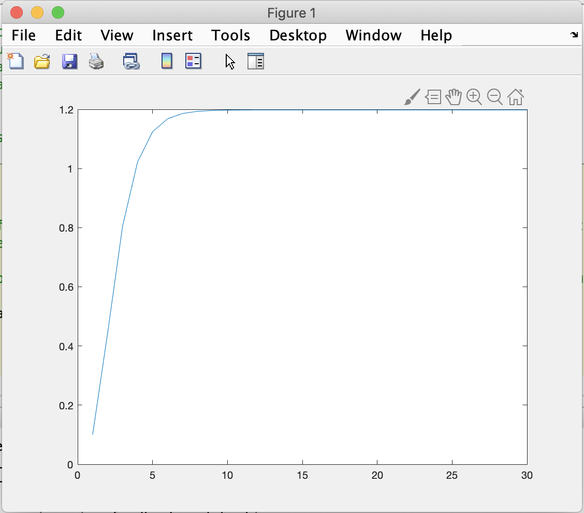
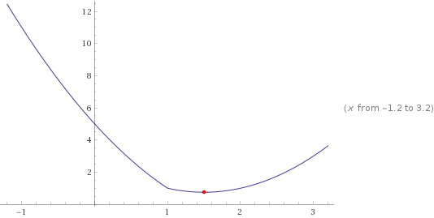

# Applied Exercises

## 1. Writing a custom "regress" function

In this exercise you will write your custom function which accepts a vector of dependent variables and a matrix of regressors and computes the OLS estimator as well as its standard error.



Write a function which accepts a vector `y` and a matrix `X` \(without the column of ones\) as inputs and which returns a $$2 \times N$$ matrix where the first row carries the estimated regression coefficients and the second row carries their standard errors.

Check your function works appropriately by comparing to MATLAB's `regress`function.

**Extension 1 - Constant in the regression:** __Extend the function to accept a boolean argument `constant`which determines whether a constant should be included in the regression.

**Extension 2** - **Using structure array objects to return estimated values\):** Read the [MATLAB reference page on structure arrays](https://www.mathworks.com/help/matlab/ref/struct.html) to learn about `struct` objects. Modify your OLS function such that it returns a struct object `estimates` with sub-objects `estimates.params` and `estimates.se` which contain the parameter estimates and standard errors, respectively.



* Create a new folder for this exercise and copy the _olsdata.mat_ file that you downloaded from this page into it.
* In MATLAB, create a new script and save it into the same folder naming it e.g. `exercise01.m`.
* Start your script with the following commands

```text
  clear all; close all; clc;
  load olsdata.m
```

This will clear everything and load the data into your workspace.

* Inspect the workspace window. You should see a matrix `X` and a vector `y`.
* The goal of this exercise is to estimate `beta_true` by ordinary least squares \(OLS\) and to compute its standard errors using the formula above.
* Like in exercise one of unit one, code up the ols estimator using matrix algebra.

```text
beta_hat = ...formula goes here...
```

* Then compute the estimate $$\hat{\sigma}^2$$ using the formula from the theory section

```text
sigma2_hat = ...formula goes here...
```

* Finally, estimate the variance-covariance matrix of the estimator $$\hat{Var}(\hat{\beta} \lvert X)$$ using the formula given above. Note that the expression should involve your estimate `sigma2_hat`.

```text
V_beta_hat = ...formula involving sigma2_hat...
```

* Finally, extract the estimated variances of $$\hat{\beta}$$ from the diagonal of the variance-covariance matrix and take the square root to get standard errors.

```text
se_beta = ...formula involving diagonal of V_beta_hat...
```

* Now you have two column vectors, `beta` which is $$3 \times 1$$ and `se_beta` which is $$3\times 1$$. Think about how to concatenate them into a $$2 \times 3$$ matrix where the first row carries `beta` and the second row carries `se_beta`.
* After successfully testing your script, move all code after loading the data into a new file where you declare a function that accepts `y` and `X` as inputs and returns the concatenated matrix. Save this function as `run_ols.m` in your main folder.
* Modify your script so that it looks like this:



```text
clear all; close all; clc;
load olsdata.mat

ols_result = run_ols(y, X);
ols_result
```



* Run your script and verify that your OLS function is being called and that the correct result is delivered.





### Theory

Let $$y$$ be a $$T \times 1$$ vector of data on the dependent variable and let $$X$$ be a $$T \times N$$ matrix with data on the regressors \(where the first column is a vector of ones\).

The OLS estimator of the regression coefficients is defined as.

$$\hat{\beta} = (X'X)^{-1} (X'y)$$

Under the assumption of spherical errors, and estimate of the variance-covariance matrix of the estimator can be obtained as

$$\hat{Var}(\hat{\beta} \vert X) = \hat{\sigma}^2 \;(X'X)^{-1}$$

where

$$\hat{\sigma}^2 = \frac{(y-X\hat{\beta})'(y-X\hat{\beta})}{T-N}$$

The standard errors of the elements of $$\hat{\beta}$$ are defined as the square root of the diagonal elements of $$\hat{Var}(\hat{\beta}\vert X)$$.  


## 2. Simulating capital evolution in the canonical OLG model

In this exercise you will simulate a capital evolution in a simple canonical OLG model.



Write a script that calculates a vector that contains the evolution of capital for $$T=30$$ periods when initial capital per worker is $$k_0=0.1$$ for the following parameter values.

| **Parameter** | **Value** |
| :--- | :--- |
| $$A$$ | 4 |
| $$\alpha$$ | 0.4 |
| $$\beta$$ | 0.9 |
| $$n$$ | 0.02 |

**Tip:** Create a vector of zeros of appropriate size, then loop through the elements of the vector and fill in the values of capital per worker.

When you have finished you can plot the resulting vector with the command `plot(k)` where `k` is the vector holding the evolution of capital. How many periods does it take the economy to reach its steady state \(i.e. capital per worker does not change anymore\)? Now try out to simulate the economy for different parameter values. Does a steady state exist and how long does it take to get there?



* Create a new folder for this exercise and create a new script in MATLAB which you save into the same folder naming it e.g. 'exercise02.m'.
* Start your script with the following commands

```text
  clear all; close all; clc;
```

This will clear everything.

* We would like to store the values of $$k_t$$ for $$t=1, ..., T$$ in a vector. Initialise the vector at the beginning of your code by creating a vector of `NaN` or `zero` values.

```text
k = nan(...appropriate dimensions here...)
```

* Think about how you can use a loop to calculate the values of $$k$$ iteratively. How does this loop look like? Where does it start and where does it end. How do you save a single value that you computed for $$k_{t+1}$$ in the vector you created in the step before?



If you have implemented the exercise correctly, your plot of the evolution of the capital stock should look like this.





### Theory

In the canonical overlapping-generations \(OLG\) model, the evolution of the capital stock per worker is described by the following law of motion.

$$k_{t+1} = \frac{1}{1+n} \frac{\beta}{1+\beta} \; (1-\alpha) \; A \; k_t^\alpha$$

where $$k$$ is the capital per worker, $$n$$ is the population growth rate, $$\beta$$ is the discount factor, $$\alpha$$ is the capital share in the production function and $$A$$ is the TFP parameter from the production function.

## 3. Minimization of a non-differentiable function by bisection

In this exercise you will implement a simple algorithm to find the minimum of a non-differentiable function by bisection minimization.



Code up the algorithm that is described in the theory section below to find the minimum of $$f(x)$$ on the interval $$[0, 5]$$.

**Tips:** Use a while loop which iterates on the algorithm steps 1-4 until convergence is achieved. Use variables to keep track of the old and new candidate values for $$x^{min}$$.



### Theory

In this exercise, you will find the minimum of the following non-differentiable function on the interval $$[a, b]$$.

$$f(x) = \lvert x - 1 \rvert + (x-2)^2$$

Here is a plot of this function with the respective minimum



To find the minimum of $$f(x)$$ on the interval, use the following algorithm:

1. Pick the point in the middle of the interval $$x_M$$. This splits the interval into two intervals, the left interval $$[a, x_M]$$ and the right interval $$(x_M,b]$$
2. In each half, pick as a candidate for a maximum $$x_L$$ and $$x_R$$ as the middle point of the respective interval
3. Evaluate $$f(x_L)$$ and $$f(x_R)$$
4. Now two cases are possible

* \(a\) If $$f(x_L)>f(x_R)$$ i.e. the minimizer is in the right interval. If this is true, set the new interval equal to the right interval.
* \(b\) If $$f(x_L)<=f(x_R)$$, the minimizer is in the left interval. If this is true, set the new interval equal to the left interval.

1. Using the new interval $$[a^*, b^*]$$, repeat steps 1-4 until the absolute difference between the new and cold candidate is smaller than `1e-5`.

